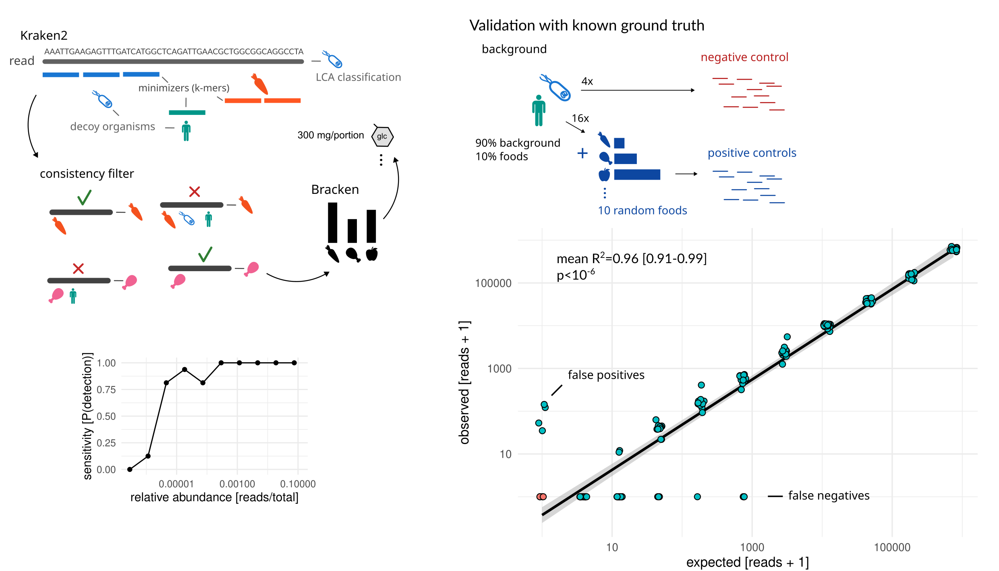
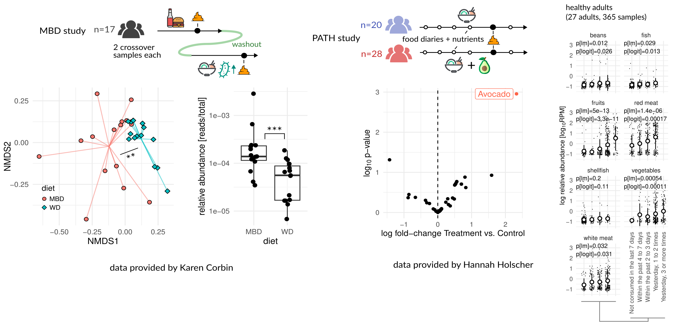
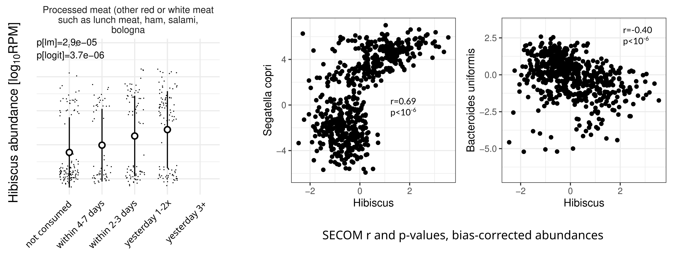

<!-- .slide: data-background="assets/cover1.jpg" class="dark no-logo" -->

# A scalable metagenomic approach for joint quantification of gut microbiome and dietary intake

Christian Diener 
D&RI of Hygiene, Microbiology and Environmental Medicine

  

<a href="https://creativecommons.org/licenses/by-sa/4.0/"><i class="fa-solid fa-camera-retro"></i>mixed</a>
<a href="https://dienerlab.com"><i class="fa-solid fa-house-signal"></i></i>dienerlab.com</a>
<a href="https://github.com/dienerlab"><i class="fa-brands fa-github"></i>dienerlab</a>
<a href="https://bsky.app/profile/cdiener.com"><i class="fa-brands fa-bluesky"></i></i>@cdiener.com</a>

---

<!-- .slide: data-background="var(--primary)" class="dark" -->

*Metagenomic* (total DNA) sequencing of fecal samples is widely used in microbiome studies.

Many foods we consume contain highly specific DNA sequences as well.

DNA can potentially comply with the requirements of a biomarker and there are some established
marker genes (<i>trnL</i> or 12S rRNA gene).

Can we leverage total fecal DNA to measure food intake?

C Cuparencu et al. 2024, Nature Metabolism, https://doi.org/10.1038/s42255-024-01067-y

BL Petrone et al. 2023, PNAS, https://doi.org/10.1073/pnas.2304441120

---

<!-- .slide: data-background="var(--primary)" class="dark" -->

 

Challenges lie in the lack of *food-specific genome databases* and the *low biomass*
of foods in fecal samples compared to microbes. MEDI attempts to solve those.

---

## A database of food DNA database linked to nutrients

---

## A decoy-aware mapping strategy

---

## Validation with controlled-feeding studies and FFQs

---

## A processed food signal associated with the gut microbiome

May be related to carboxymethylcellulose (CMC) levels 
https://doi.org/10.1101/2025.02.21.639485

---

<!-- .slide: data-background="assets/meduni/campus.png" class="hero no-logo" -->

# Thanks! :smile:

  

**MedUni Graz** 
Klara Filek 
Christine Moissl-Eichinger

**U of I Urbana-Champaign** 
Hannah Holscher

**AdventHealth** 
Karen Corbin

**ISB** 
Sean Gibbons

**Funding** 

 

C Diener et al. 2025, Nature Metabolism, https://doi.org/10.1038/s42255-025-01220-1

---

<!-- .slide: data-background="var(--primary)" class="dark" -->

## Take home messages

*Strengths*:

- high specificity (down to strain level)
- quantitative for foods and semi-quantitative for nutrients
- nice for retrospective studies
- high throughput

*Limitations*:

- cannot distinguish preparation types or site 
  → resolve with proteomics or metabolomics?
- bias towards non-digested food 
- sensitivity limited by low food DNA proportion 
  → deeper sequencing?
- detection dependent on consumption time 
  → pooling or time series?