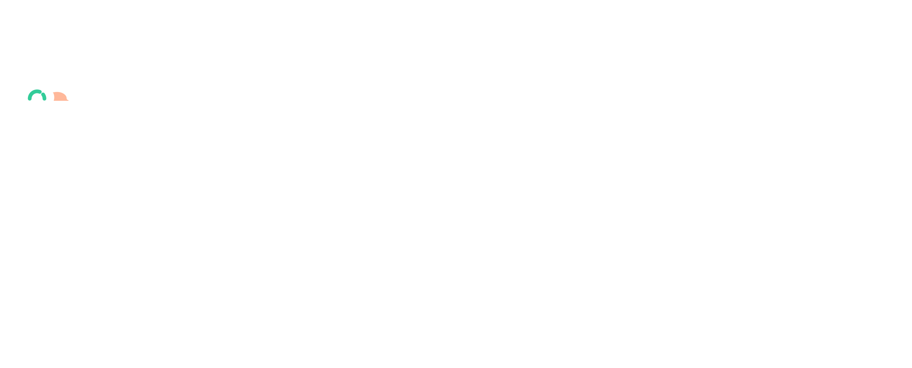
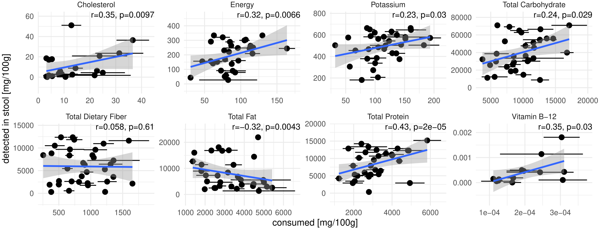
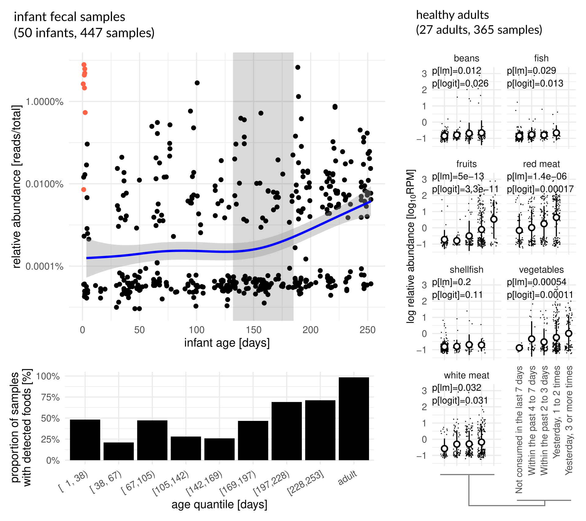

<!-- .slide: data-background="assets/cover1.jpg" class="dark no-logo" -->

# Metagenomic estimation of dietary intake

Christian Diener 
D&RI of Hygiene, Microbiology and Environmental Medicine

  

<a href="https://creativecommons.org/licenses/by-sa/4.0/"><i class="fa-solid fa-camera-retro"></i>CC BY-SA 4.0</a>
<a href="https://dienerlab.com"><i class="fa-solid fa-house-signal"></i></i>dienerlab.com</a>
<a href="https://github.com/dienerlab"><i class="fa-brands fa-github"></i>dienerlab</a>
<a href="https://bsky.app/profile/cdiener.com"><i class="fa-brands fa-bluesky"></i></i>@cdiener.com</a>

---

<!-- .slide: data-background="var(--primary)" class="dark" -->

Many foods we consume contain highly specific DNA sequences.

DNA can potentially comply with the requirements of a biomarker and there are some established
marker genes (<i>trnL</i> or 12S rRNA gene).

Can we leverage total DNA as a biomarker for food intake?

Focused on fecal samples due to the wide use in microbiome studies.

C Cuparencu et al. 2024, Nature Metabolism, https://doi.org/10.1038/s42255-024-01067-y

BL Petrone et al. 2023, PNAS, https://doi.org/10.1073/pnas.2304441120

---

<!-- .slide: data-background="var(--primary)" class="dark" -->

 

C Diener et al. 2025, Nature Metabolism, https://doi.org/10.1038/s42255-025-01220-1

---

## A database of food DNA database linked to nutrients

---

## A decoy-aware mapping strategy

---

## Validation with controlled-feeding studies

---

## Predicted nutrient content correlates with food diaries

---

## Metagenomic food quantifications across infants and adults

Lots of dropouts.

Anticipates onset of solid food consumption in infants.

Good correspondence with FFQs and higher correspondence with gut microbiome composition (Mantel test) than FFQs.

---

<!-- .slide: data-background="var(--primary)" class="dark" -->

## Take home messages

*Strengths*:

- high specificity (down to strain level)
- quantitative for foods and semi-quantitative for nutrients
- cheap
- nice for retrospective studies
- high throughput

*Limitations*:

- cannot distinguish preparation types or site 
  → resolve with proteomics or metabolomics?
- bias towards non-digested food 
- sensitivity limited by low food DNA proportion 
  → deeper sequencing?
- detection dependent on consumption time 
  → pooling or time series?

---

<!-- .slide: data-background="assets/meduni/campus.png" class="hero no-logo" -->

# Thanks! :smile:

  

**MedUni Graz** 
Klara Filek 
Christine Moissl-Eichinger

**U of I Urbana-Champaign** 
Hannah Holscher

**AdventHealth** 
Karen Corbin

**ISB** 
Sean Gibbons

**Funding** 

 

Recruiting a PhD student for winter 2025. 
https://dienerlab.com/posts/phd2025