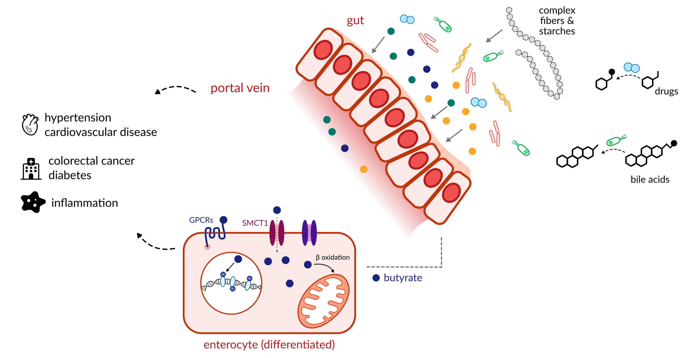
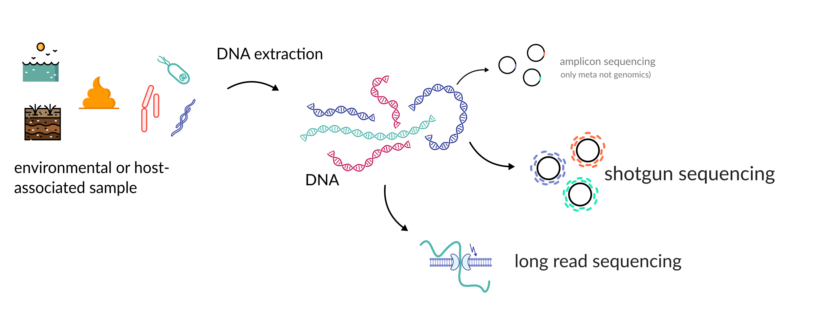
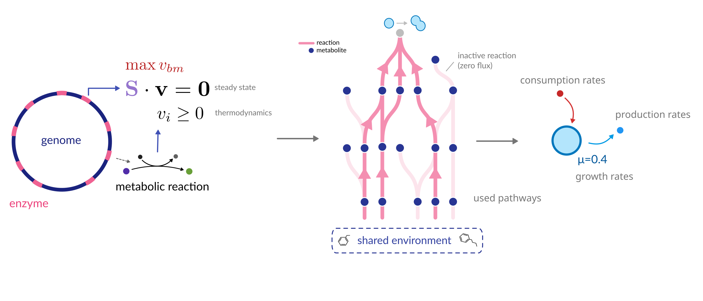
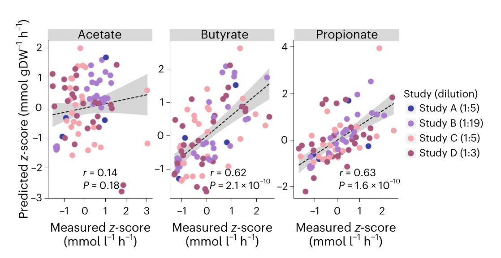
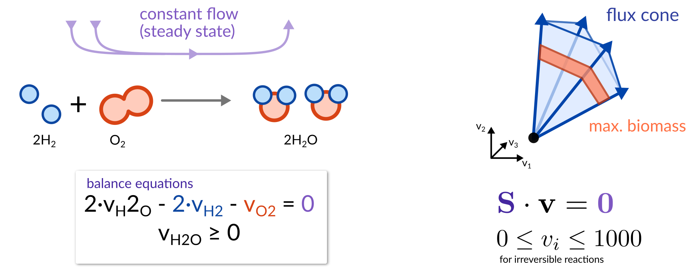
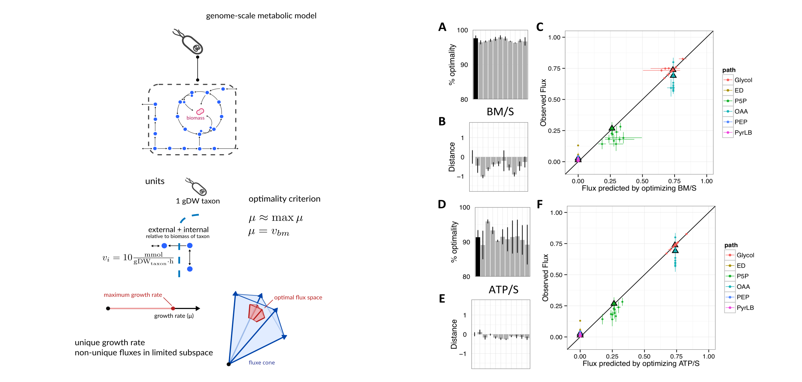
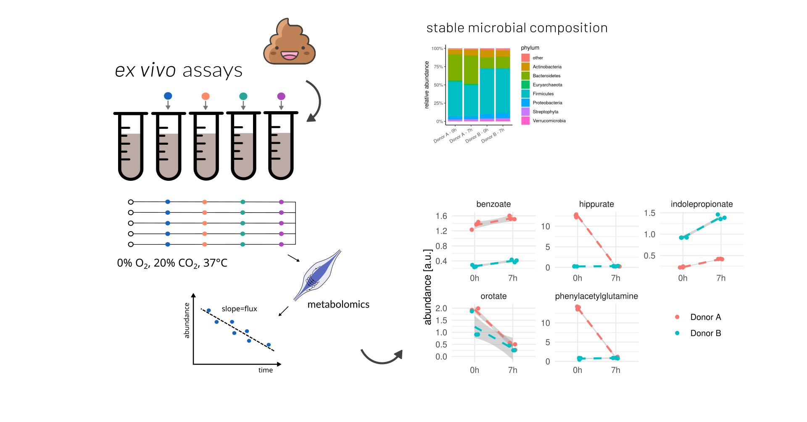

<!-- .slide: data-background="assets/ghibli_microbiome4.jpeg" class="dark no-logo" -->

# From environment to intervention:  Getting more from metagenomics data

Christian Diener 
D&RI of Hygiene, Microbiology and Environmental Medicine

  

<a href="https://creativecommons.org/licenses/by-sa/4.0/"><i class="fa-solid fa-camera-retro"></i>CC BY-SA 4.0</a>
<a href="https://dienerlab.com"><i class="fa-solid fa-house-signal"></i></i>dienerlab.com</a>
<a href="https://github.com/dienerlab"><i class="fa-brands fa-github"></i>dienerlab</a>
<a href="https://bsky.app/profile/cdiener.com"><i class="fa-brands fa-bluesky"></i></i>@cdiener.com</a>

---

## The blood-microbiome axis

The human gut microbiome impacts physiology through a complex *interplay* between *microbes*, the *environment*,
and the *host*.

---

## Metagenomic sequencing

Metagenomics, while highly scalable, mostly focuses on *bacteria* and other microbial organisms and associating
their (gene) abundances to phenotypes.

Can we glean information about the *environment* from metagenomics data?

---

<!-- .slide: data-background="var(--primary)" class="dark" -->

## Metagenomic estimation of dietary intake

Many foods we consume contain highly specific DNA sequences.

DNA can potentially comply with the requirements of a biomarker and there are some established
marker genes (<i>trnL</i> or 12S rRNA gene).

Can we leverage total fecal DNA as a biomarker for food intake?

Cuparencu et al. 2024, Nature Metabolism, https://doi.org/10.1038/s42255-024-01067-y

Petrone et al. 2023, PNAS, https://doi.org/10.1073/pnas.2304441120

---

<!-- .slide: data-background="var(--primary)" class="dark" -->

 

Diener* et al. 2025, Nature Metabolism, https://doi.org/10.1038/s42255-025-01220-1

---

## A database of food DNA database linked to nutrients

---

## A decoy-aware mapping strategy

---

## Validation with controlled-feeding studies

---

## Predicted nutrient content correlates with food diaries

---

## Metagenomic food quantifications across infants and adults

Lots of dropouts.

Anticipates onset of solid food consumption in infants.

Good correspondence with FFQs and higher correspondence with gut microbiome composition (Mantel test) than FFQs.

---

<!-- .slide: data-background="assets/backdrop.webp" class="dark" -->

## Microbial community-scale metabolic modeling

We can see the *pieces* of the game, but what are the *rules*?

Knowing how diet *causally* affects the function of microbial communities is and how
we can *intervene* is the basis for therapeutic use. One possible set of rules are posed
by *metabolism*.

What can we learn about *metabolism* from metagenomic data?

---

## Quantifying metabolism through fluxes

<video width="45%" autoplay loop>
  <source src="assets/fluxes.mp4" type="video/mp4">
</video>

"How fast does a species grow?" and "How much of this metabolite is produced?" are
questions about *fluxes, not concentrations*.

---

## Flux Balance Analysis (FBA)

---

## Mechanistic modeling from metagenomic data

Predicts *steady state fluxes* of individual taxa in complex communities and *single samples*.

Integrates interactions with (emergent) *environment*.

Diener et al. 2020, mSystems, https://doi.org/10.1128/mSystems.00606-19 
Diener & Gibbons 2023, mSystems, https://doi.org/10.1128/msystems.01270-22 
Quinn-Bohmann, Carr, Diener* & Gibbons*, Nature Microbiology 2025, https://doi.org/10.1038/s41564-025-01972-2

---

## Screen and ex vivo validation

---

## Rational prediction of SCFA production after fiber intervention

Quinn-Bohmann, ..., Diener* & Gibbons*, Nature Microbiology 2024, https://doi.org/10.1101/2023.02.28.530516

---

## Strong association with host blood chemistries

Arivale cohort (n=3,129), adjusted for sex, age, and BMI

---

## There is no one-fits-all intervention for butyrate production

---

<!-- .slide: data-background="var(--primary)" class="dark" -->

## Take home messages

- remaining food DNA can be identified in metagenomic sequencing by decoy-aware mapping
  - there might be use in *sequencing deeper*
- while generally low abundance food DNA can give insights into habitual *intake* and nutrient
  content
  - *simultaneous* measurement
- microbial community metabolic modeling can predict the effect of select interventions
  - *rational* prediction
- large-scale screening and validation by <i>in silico</i> ⇋ <i>ex vivo</i> loops
  - <i>ex vivo</i> assays running soon* at ZMF2

---

<!-- .slide: data-background="assets/meduni/flags.png" class="hero no-logo" -->

# Thanks! :smile:

<a href="https://dienerlab.com"><i class="fa-solid fa-house-signal"></i></i>&nbsp;https://dienerlab.com</a>

 

**MedUni Graz** 
Klara Filek 
Christine Moissl-Eichinger 
Gregor Georkiewicz

**ISB** 
Sean Gibbons 
Nick Quinn-Bohmann 
Kat Ramos-Sarmiento 
Alex Carr

**U of I Urbana-Champaign** 
Hannah Holscher

**AdventHealth** 
Karen Corbin

**Funding** 
&nbsp;

Other topics:

- drug-microbiome interactions (statins)
- microbiome during aging

---

---

## Genome-scale metabolic models - pretty well-behaved

Schuetz et al. 2012, https://doi.org/10.1126/science.1216882 
Harcombe et al. 2013, https://doi.org/10.1371/journal.pcbi.1003091

---

## Community-scale metabolic models - pretty rowdy

Diener et al. 2023, https://doi.org/10.1128/msystems.01270-22 
Senne de Oliveira Lino et al. 2021, https://doi.org/10.1038/s41467-021-21844-7

---

## Anaerobic <i>ex vivo</i> fermentation

