<!-- .slide: data-background="assets/ghibli_microbiome2.jpeg" class="dark no-logo" -->

# Alfonso Lopez lab meeting

Christian Diener 
D&RI of Hygiene, Microbiology and Environmental Medicine

  

<a href="https://creativecommons.org/licenses/by-sa/4.0/"><i class="fa-solid fa-camera-retro"></i>CC BY-SA 4.0</a>
<a href="https://dienerlab.com"><i class="fa-solid fa-house-signal"></i></i>dienerlab.com</a>
<a href="https://github.com/dienerlab"><i class="fa-brands fa-github"></i>dienerlab</a>
<a href="https://bsky.app/profile/cdiener.com"><i class="fa-brands fa-bluesky"></i></i>@cdiener.com</a>

---

<!-- .slide: data-background="var(--primary)" class="dark" -->

## Who we are and what we do

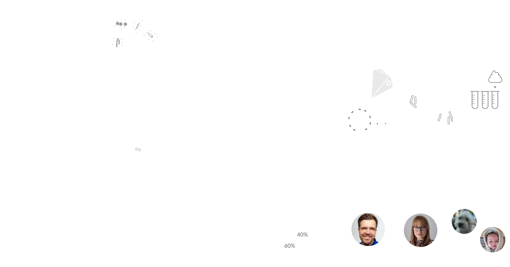

---

## The blood-microbiome axis

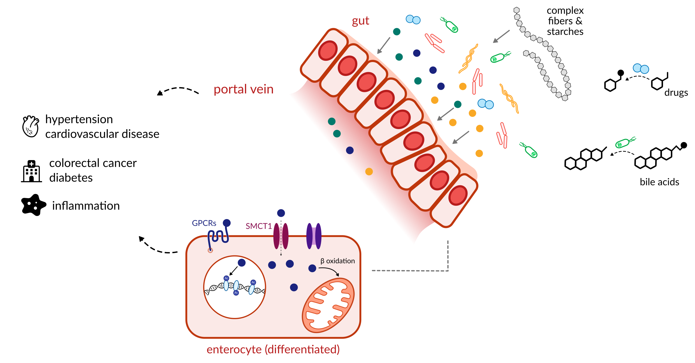

---

## Genome-microbiome interplay in the human blood metabolome

Diener, Dai, et. al., Nature Metabolism 2022, https://doi.org/10.1038/s42255-022-00670-1 

---

## The fate of bile acids determined by genetics and the microbiome

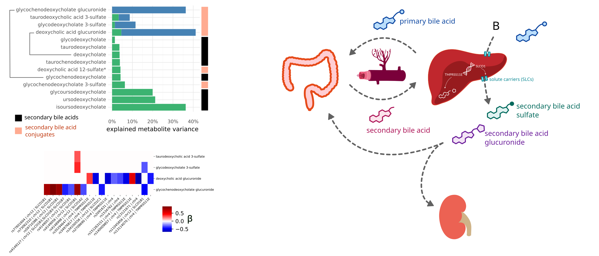

---

<!-- .slide: data-background="assets/ricards-zvagulis.jpg" class="dark" -->

# What are the rules?

Though we can get associations from large cross-sectional studies the mechanisms remain
unclear.

How dow we get from correlation to intervention?

---

## Mechanistic modeling from metagenomic data

Predicts *steady state fluxes* of individual taxa in complex communities and *single samples*.

Integrates interactions with (emergent) *environment*.

---

## Anaerobic <i>ex vivo</i> fermentation

---

## MCMMs can predict personalized SCFA prediction after intervention

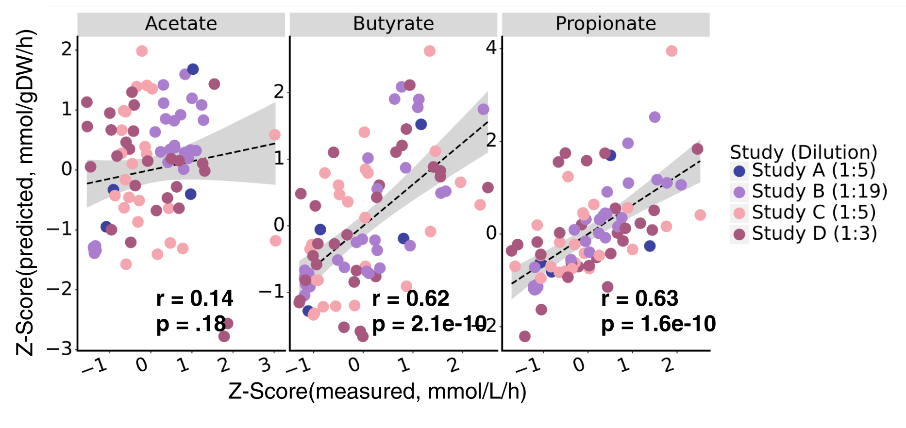

Quinn-Bohmann, ..., Diener* & Gibbons*, Nature Microbiology 2024, https://doi.org/10.1101/2023.02.28.530516

---

## What's next?

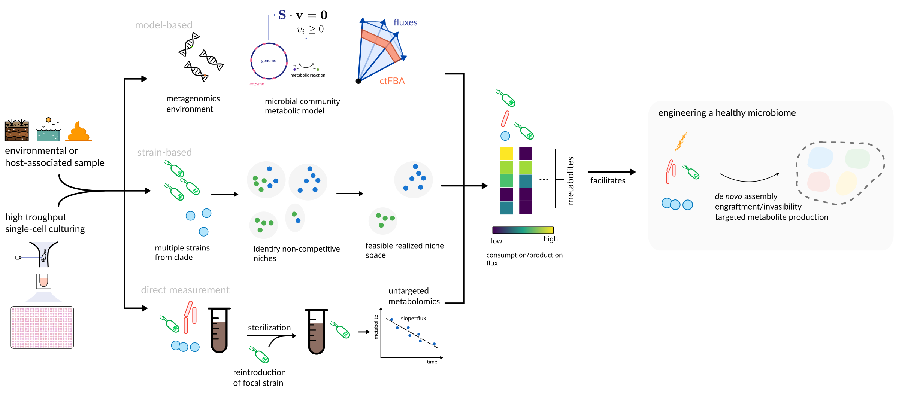

---

<!-- .slide: data-background="assets/meduni/flags.png" class="hero no-logo" -->

# Thanks! :smile:

<a href="https://dienerlab.com"><i class="fa-solid fa-house-signal"></i></i>&nbsp;https://dienerlab.com</a>

 

**MedUni Graz** 
Klara Filek 
Christine Moissl-Eichinger

**ISB** 
Sean Gibbons 
Nick Quinn-Bohmann 
Kat Ramos-Sarmiento 
Alex Carr

**U of I Urbana-Champaign** 
Hannah Holscher

**AdventHealth** 
Karen Corbin

**Funding** 
&nbsp;

Other topics:

- drug-microbiome interactions (statins)
- metagenomic estimation of dietary intake
- microbiome during ageing

---

<!-- .slide: data-background="var(--primary)" class="dark" -->

# Drug-microbiome interactions

----

## The gut microbiome affects statin efficacy

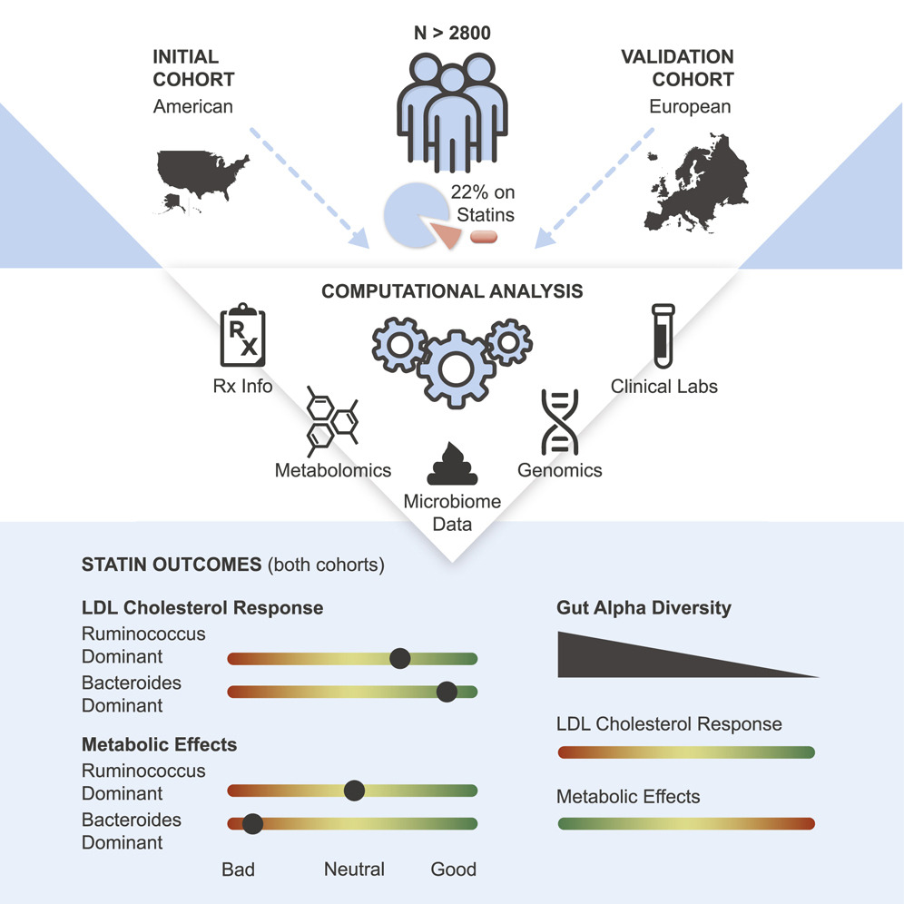&nbsp;
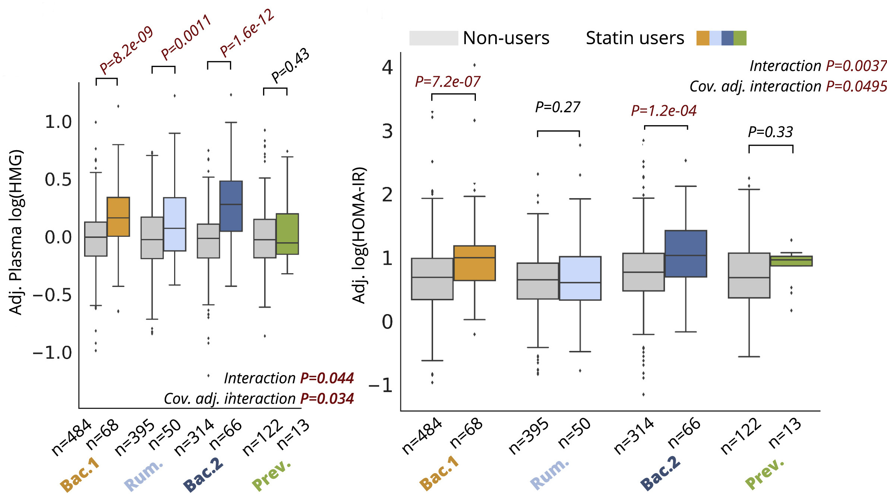

Heterogeneity in *statin efficacy* is explained by gut microbiome composition.

Looking for *local collaborators* to continue functional analyses.

Vieira-Silva, Falony, Belda, Nature 2020, https://doi.org/10.1038/s41586-020-2269-x 
Wilmanski, Kornilov, Diener et al., Med 2022, https://doi.org/10.1016/j.medj.2022.04.007

---

<!-- .slide: data-background="var(--primary)" class="dark" -->

# Metagenomic estimation of dietary intake

----

<!-- .slide: data-background="var(--primary)" class="dark" -->

Many foods we consume contain highly specific DNA sequences.

DNA can potentially comply with the requirements of a biomarker and there are some established
marker genes (<i>trnL</i> or 12S rRNA gene).

Can we leverage total DNA as a biomarker for food intake?

Focused on fecal samples due to the wide use in microbiome studies.

Cuparencu et al. 2024, Nature Metabolism, https://doi.org/10.1038/s42255-024-01067-y

Petrone et al. 2023, PNAS, https://doi.org/10.1073/pnas.2304441120

----

<!-- .slide: data-background="var(--primary)" class="dark" -->

 

Diener* et al. 2025, Nature Metabolism, https://doi.org/10.1038/s42255-025-01220-1

----

## A database of food DNA database linked to nutrients

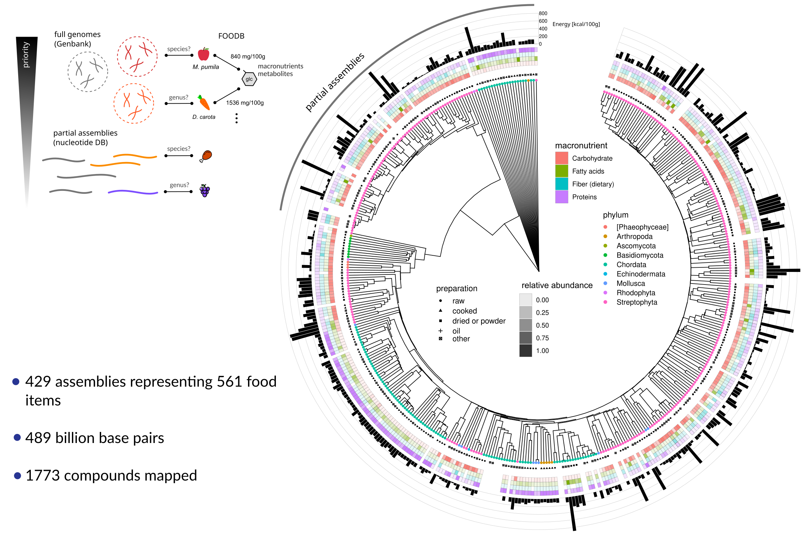

----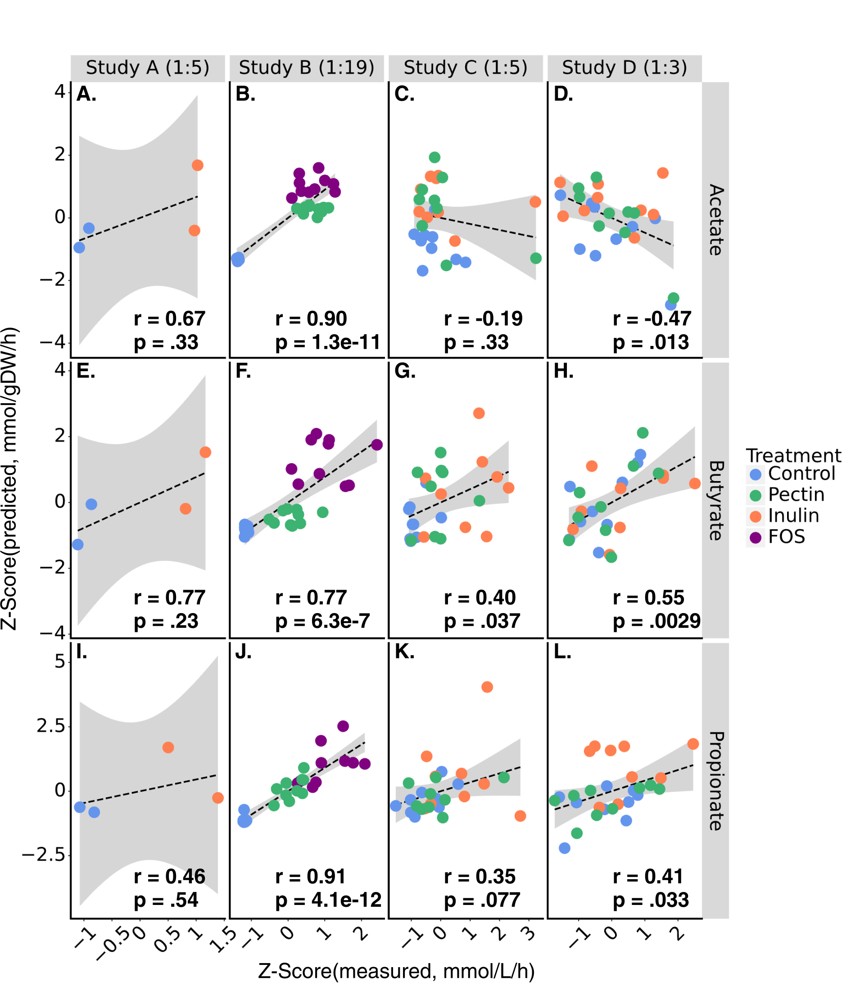

## A decoy-aware mapping strategy

----

## Validation with controlled-feeding studies

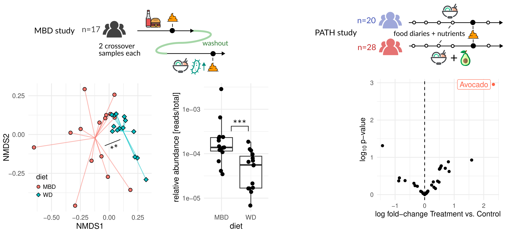

----

## Predicted nutrient content correlates with food diaries

----

## Metagenomic food quantifications across infants and adults

Lots of dropouts.

Anticipates onset of solid food consumption in infants.

Good correspondence with FFQs and higher correspondence with gut microbiome composition (Mantel test) than FFQs.

----

<!-- .slide: data-background="var(--primary)" class="dark" -->

## Take home messages

*Strengths*:

- high specificity (down to strain level)
- quantitative for foods and semi-quantitative for nutrients
- cheap
- nice for retrospective studies
- high throughput

*Limitations*:

- cannot distinguish preparation types or site 
  → resolve with proteomics or metabolomics?
- bias towards non-digested food 
- sensitivity limited by low food DNA proportion 
  → deeper sequencing?
- detection dependent on consumption time 
  → pooling or time series?

---

<!-- .slide: data-background="var(--primary)" class="dark" -->

# Microbial community-scale metabolic modeling

----

## Quantifying Metabolism - Fluxes

<video width="45%" autoplay loop>
  <source src="assets/fluxes.mp4" type="video/mp4">
</video>

"How fast does a species grow?" and "How much of this metabolite is produced?" are
questions about *fluxes, not concentrations*.

----

----

## Genome-scale metabolic models - pretty well-behaved

Schuetz et al. 2012, https://doi.org/10.1126/science.1216882 
Harcombe et al. 2013, https://doi.org/10.1371/journal.pcbi.1003091

----

## Community-scale metabolic models - pretty rowdy

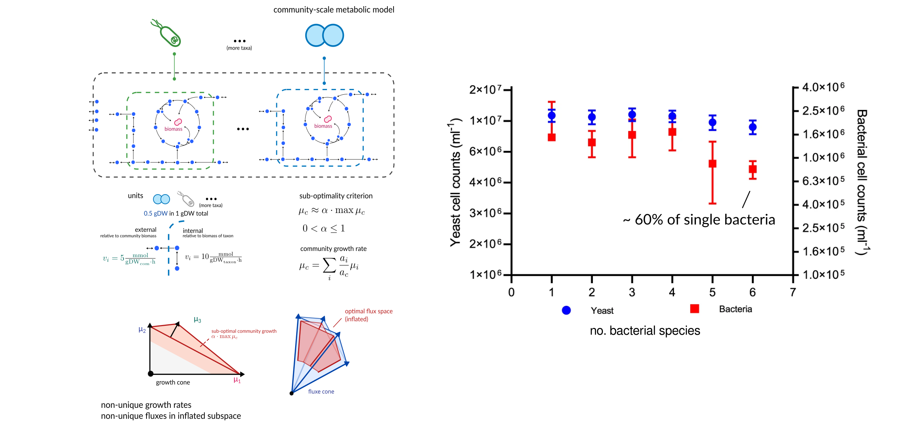

Diener et al. 2023, https://doi.org/10.1128/msystems.01270-22 
Senne de Oliveira Lino et al. 2021, https://doi.org/10.1038/s41467-021-21844-7

----

## Scalable and identifiable simulation

That makes full community-scale metabolic models *usable*.

But even curated metabolic models for many species do not capture the full complexity of
metabolism. So are those models also *useful*?

How do we *validate* the model predictions?

----

## Is it better than the status quo?

186 metagenome samples from Swedish and Danish individuals. 
Manually curated metabolic models from the AGORA database. 
Import fluxes based on an average European diet.

Diener et al. 2020, https://doi.org/10.1128/mSystems.00606-19 
Korem, Suez, Zeevi, Weinberger et al. 2015, https://dx.doi.org/10.1126%2Fscience.aac4812 
Magnúsdóttir et al., https://doi.org/10.1038/nbt.3703

----

## Screen and validate interventions in the gut microbiome

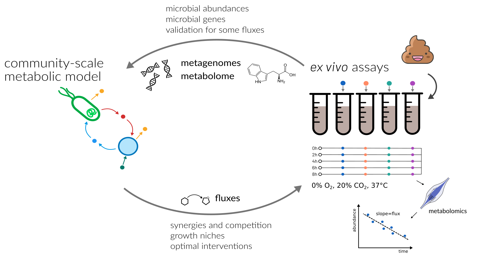

----

## Short-chain fatty acids in the human gut

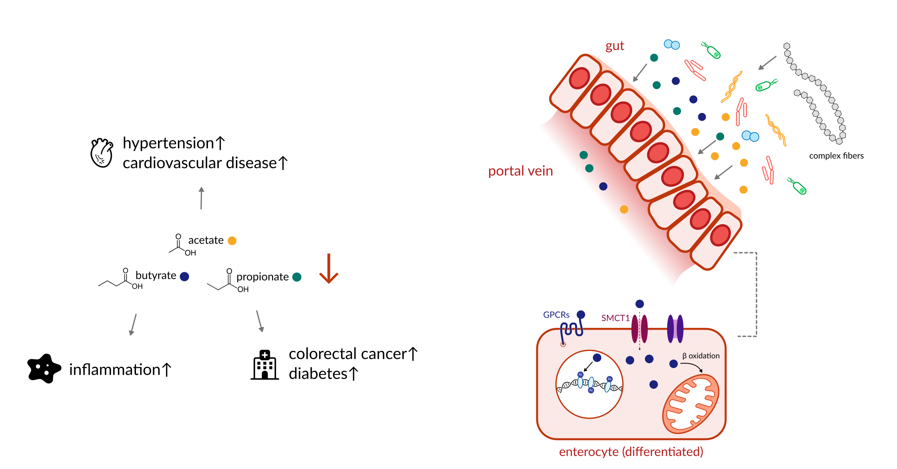

----

## Rational prediction of SCFA production <i>in vitro</i>

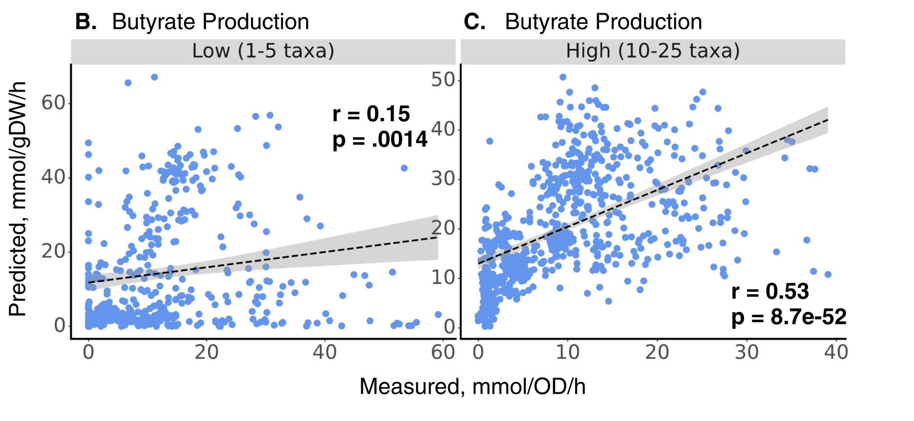

**Nick Bohmann (Gibbons Lab)**, Thomas Gurry (Myota), Ophelia Venturelli (UW-Madison) 
preprint at https://doi.org/10.1101/2023.02.28.530516

----

## ... and <i>ex vivo</i>

 

----

## Strong association with host blood chemistries

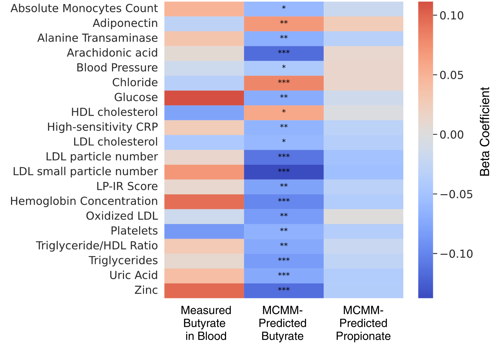

Arivale cohort (n=3,129), adjusted for sex, age, and BMI

----

## There is no one-fits-all intervention for butyrate production

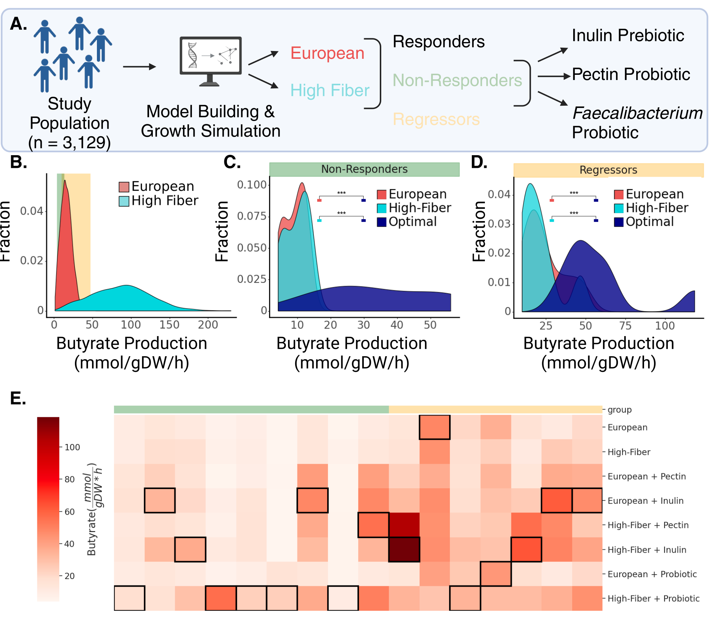

----

<!-- .slide: data-background="var(--primary)" class="dark" -->

## Summary

Microbial community metabolic models can be used to rationally predict interventions in the human gut microbiome.

Constrainig the growth cone is necessary to enrich for biologically relevant flux distributions.

Likely helpful for large-scale screening but validation is required (<i>ex vivo</i> fermentations :heart:).

