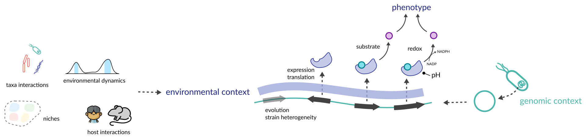
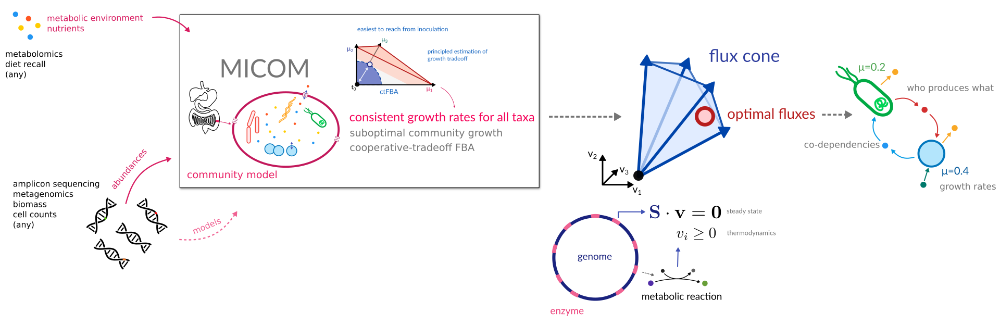
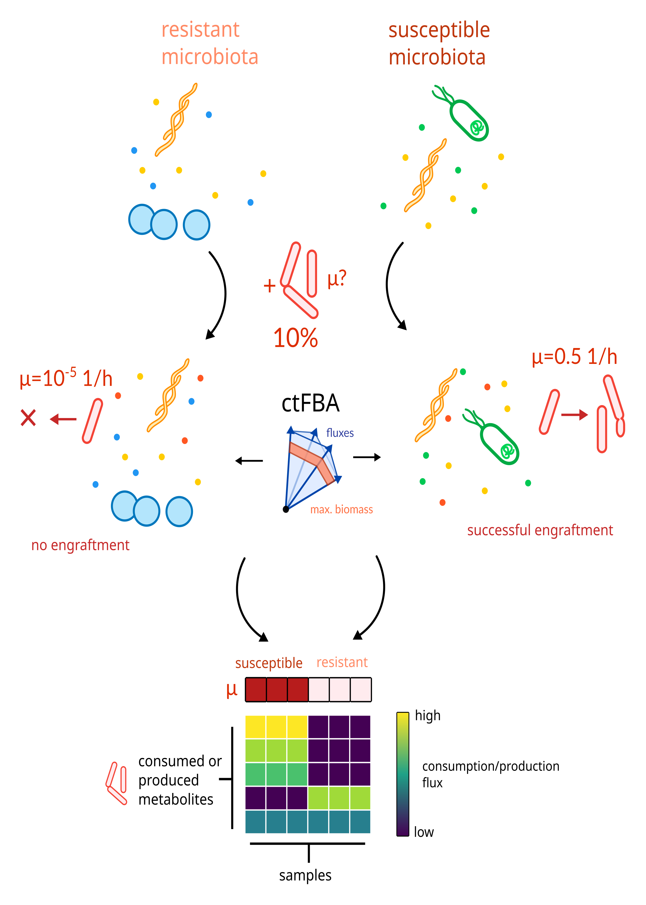
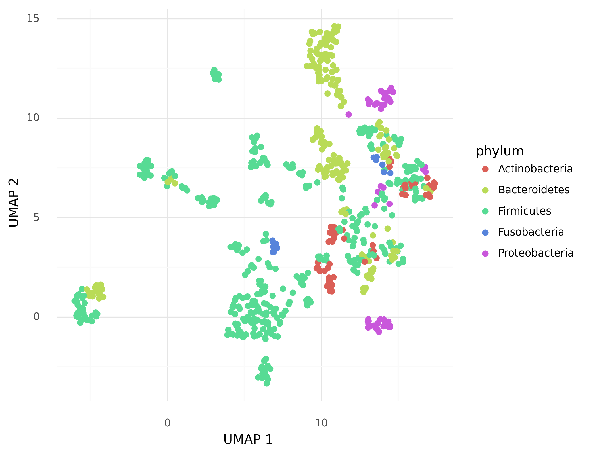
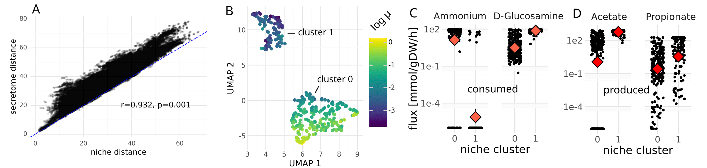
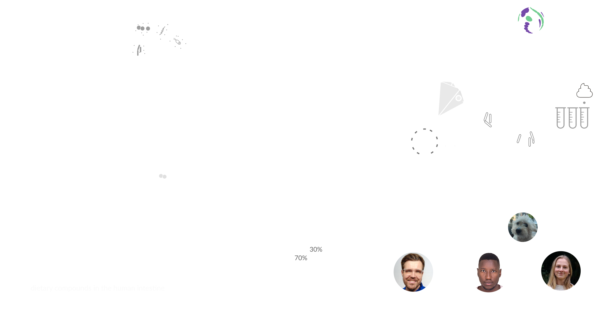

<!-- .slide: data-background="assets/backdrop.webp" class="dark no-logo" -->

# CoE Synthesis Workshop

### Christian Diener

  

<a href="https://creativecommons.org/licenses/by-sa/4.0/"><i class="fa-solid fa-camera-retro"></i>internal</a>
<a href="https://dienerlab.com"><i class="fa-solid fa-house-signal"></i></i>dienerlab.com</a>
<a href="https://github.com/dienerlab"><i class="fa-brands fa-github"></i>dienerlab</a>
<a href="https://bsky.app/profile/cdiener.com"><i class="fa-brands fa-bluesky"></i></i>@cdiener.com</a>

---

<!-- .slide: data-background="var(--primary)" class="dark" -->

# What is Synthesis (for me)

1. A set of *unified measurements* and (computational) *methods* applicable to most microbial communities
    - agnostic to the specific environment and community
    - works for host-associated and free-living communities
    - on a relevant scale
2. A set of *principles* or observations that are applicable across most microbial communities
    - principles are not rules, there can be differences within a schema
    - preferably with clear impact on the system-level phenotype (climate resilience, health, etc.)
    - basically a *way of thinking* about microbial communities

---

# Motivation

Function in complex communities is an emergent property of genomic and environmental context.

---

## Mechanistic modeling from metagenomic data & environmental context

Microbial Community Metabolic Models (MCMMs) predicts *steady state fluxes* of individual taxa in complex communities and *single samples*.

Integrates interactions with (emergent) *environment* (→ enables counterfactual designs).

---

## Couple with <i>ex vivo</i> models

---

## In the last years we and others showed that MCMMs

...quantitatively predict SCFA production after fiber interventions (environment change → function, perturbation)

...correctly predict pathogen engraftment and its reversal by probiotic therapy (simple coalescence)

...correctly predict probiotic engraftment (simple coalescence)

Quinn-Bohmann N, et al.. Metabolic modeling reveals determinants of prebiotic and probiotic treatment efficacy across multiple human intervention trials. PLoS Biol. 2026;24: e3003638. https://doi.org/10.1371/journal.pbio.3003638

Carr AV, et al. Personalized Clostridioides difficile colonization risk prediction and probiotic therapy assessment in the huan gut. Cell Syst. 2025;16: 101367. https://doi.org/10.1016/j.cels.2025.101367

Quinn-Bohmann N, et al. Moving from genome-scale to community-scale metabolic models for the human gut microbiome. Nat Microbol. 2025;10: 1055–1066. https://doi.org/10.1038/s41564-025-01972-2

Quinn-Bohmann N, et al. Microbial community-scale metabolic modelling predicts personalized short-chain fatty acid productionprofiles in the human gut. Nat Microbiol. 2024;9: 1700–1712. https://doi.org/10.1038/s41564-024-01728-4

---

## How does it fit the original proposal?

Applicable or applied in:

- WP 7.1: Microbial Growth, Biomass, and Carbon Use Efficiency 
  (also use in Red-Green Project from P. Schimel and B. Coltman)
- WP 7.2: Microbial Interaction Mechanisms and Networks in Complex Microbiomes 
  (used for SI samples)
- Ecological stoichiometry (model output)
- Growth Law (somewhat)
- Microbiome Complexity (directly addressed)
- Community dynamics and mechanisms related to the release of ‘public goods’ (model output)
- Consequences of community coalescence (engraftment prediction, in WP 5.2)

---

## General characteristics of fundamental niches are reproduced

Overall niche space is discrete.

General principle would be *niche enumeration* or *niche-function mapping* (instead of taxonomy).

---

- niche distances capture 87% of variation in metabolite secretion <i>in vitro</i> (76% <i>in vivo</i>)
- genus only captures 37%

(all PERMANOVA p<0.001)

Data captures 178 strains in MM or mice from Han, Van Treuren, et al. https://doi.org/10.1038/s41586-021-03707-9

---

# Environment

Method: predict environment from non-microbial DNA (dietary, necromass).

Applied to: wastewater data from Bergthaler lab.

- picks up a lot of lifestock
- maybe good to identify viral reservoirs

---

<!-- .slide: data-background="black" class="dark" -->

# Challenges

Fundamental community measures from the proposal are currently not applied to the majority of work packages as promised.

1. Single-cell mass distribution (LifeScale)
   - some WPs
   - done for human in Loy lab but difficult
2. Microbial community biomass (based on organic C and biomarkers)
   - maybe in the future (GC or Alto?)
3. Mass-specific microbial growth (based on 18O incorporation into DNA)
   - would love to do it for gut microbiome but it's difficult
4. Mass-specific microbial respiration.
   - similar to 3
5. Microbial community composition and diversity
   - this one is done
   - lacks data harmonization and sharing

----

<!-- .slide: data-background="black" class="dark" -->

Some datasets available in the WPs is highly specific to the research questions (capture probes, targeted MS, etc).

Lack of money and personnel to implement within CoE.

Lack of specific proof-of-concept projects out of the synthesis TTs.
- there are some good ones from other labs though (GlobDB, JMFs)

---

<!-- .slide: data-background="var(--primary)" class="hero no-logo" -->

## Thanks! :smile:

