<!-- .slide: data-background="assets/brooke-lark.jpg" class="dark no-logo" -->

## Molecular biomarkers of dietary intake - Das Ernährungsprotokoll war gestern

Christian Diener 
D&FI für Hygiene, Mikrobiologie und Umweltmedizin

51\. DACH Symposium für pädiatrische Präventiv- und Ernährungsmedizin 2025, Obergurgl

  

<a href="https://creativecommons.org/licenses/by-sa/4.0/"><i class="fa-solid fa-camera-retro"></i>CC BY-SA 4.0</a>
<a href="https://dienerlab.com"><i class="fa-solid fa-house-signal"></i></i>dienerlab.com</a>
<a href="https://github.com/dienerlab"><i class="fa-brands fa-github"></i>dienerlab</a>
<a href="https://bsky.app/profile/cdiener.com"><i class="fa-brands fa-bluesky"></i></i>@cdiener.com</a>

---

<!-- .slide: data-background="var(--primary)" class="dark" -->

## Der Status Quo

---

<!-- .slide: data-background="var(--primary)" class="dark" -->

Gibt es *objektive* Methoden die *ohne* Fragebögen auskommen?

---

## Molekulare Biomarker der Ernährung

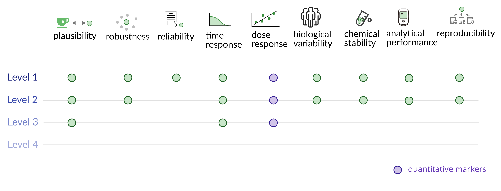

Cuparencu et al., 2024 Nature Metabolism, https://doi.org/10.1038/s42255-024-01067-y

---

## Schon im Einsatz: metabolische Marker

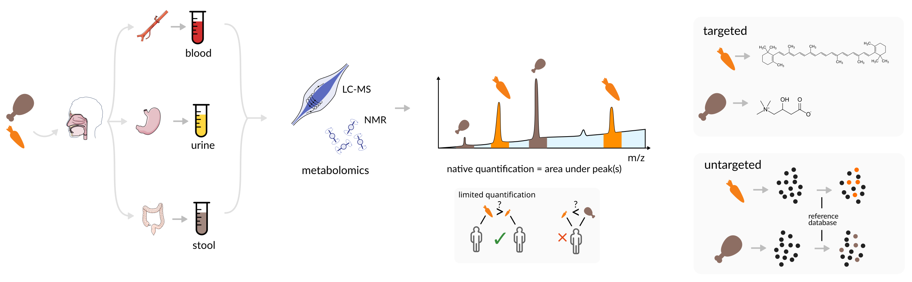

Einzelne Marker für Labensmittelgruppen schon seit langem im Einsatz (Carnitin, Carotine).

Neuer ist die Anwendung von *Breitspektrum-Methoden* (untargeted, z.B. FoodMAST).

West, Schmid, Gauglitz et al. 2022 NPJ Sci Food, https://doi.org/10.1038/s41538-022-00137-3

---

<!-- .slide: data-background="var(--primary)" class="dark" -->

Stuhlproben enthalten *überraschend* viele *Proteine* und *DNA* von Lebensmitteln. Können
wir sie potentiell als Biomarker nutzen?

---

## Metaproteomik zur Lebensmittelidentifikation

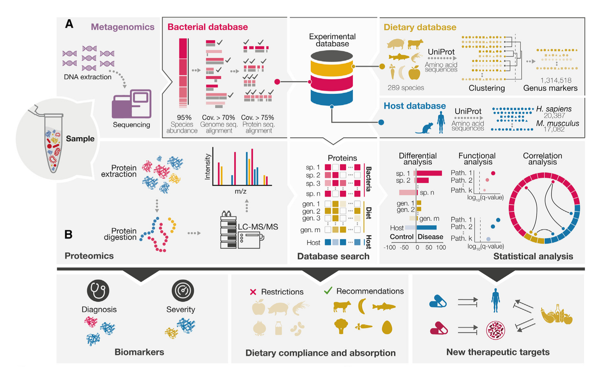

Abb. aus Valdes-Mas, Leshem, Zheng et al., 2025 Cell, https://doi.org/10.1016/j.cell.2024.12.016

---

## DNA als Ernährungsmarker - älter als man denkt

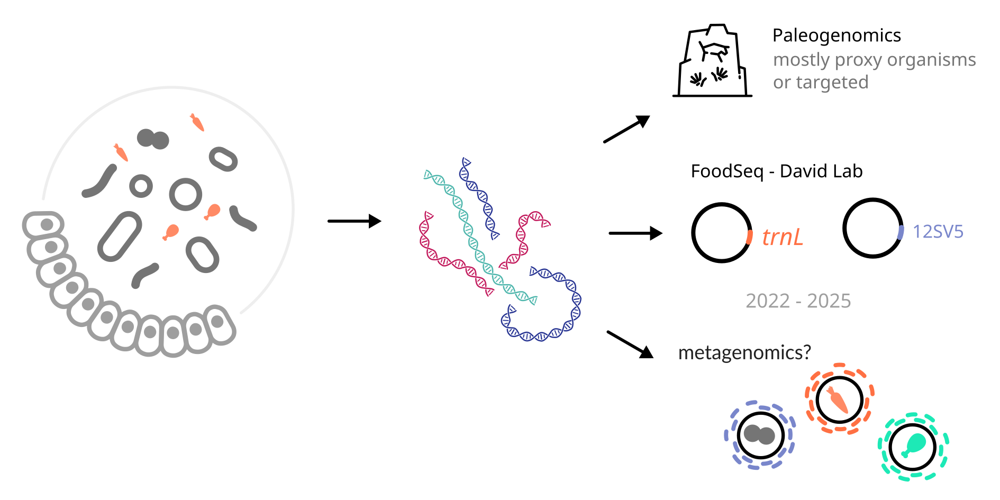

BL Petrone et al. 2023, PNAS, https://doi.org/10.1073/pnas.2304441120 
DK Superdock et al. 2025, mSystems, https://doi.org/10.1128/msystems.00158-25

----

#### Dietary plant variety in early life

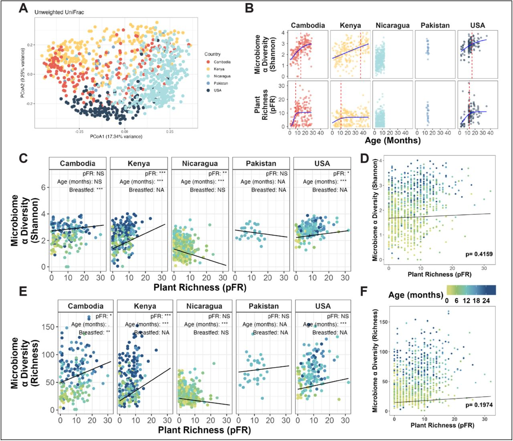

McDonald et al., preprint, https://doi.org/10.1101/2025.02.28.25323117

---

## Metagenomik - DNA von Allem

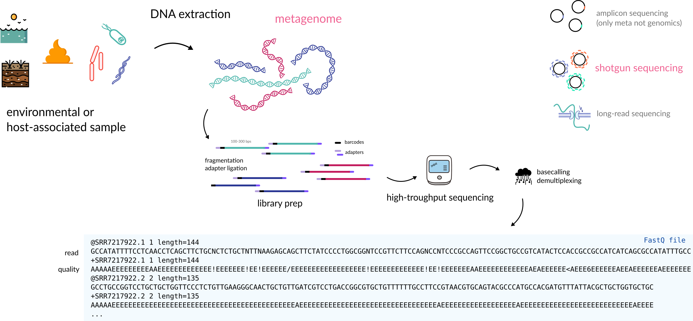

---

## Was ist dann so schwierig?

1. Obwohl es relativ große Lebensmitteldatenbanken gibt, gibt es *keine Genomdatenbank*. Für viele Lebensmittel
   gibt es noch kein repräsentatives Genom.

2. Homologie, evolutionäre Konservierung, und Probenverunreinigung führen zu *sehr vielen*
   inkorrekten Zuordnungen von bakterieller DNA zu Lebensmitteln. Die naive Methode findet daher
   oft *alle* möglichen Lebensmittel in einer Probe.

Comic von https://xkcd.com/1831/

---

<!-- .slide: data-background="var(--primary)" class="dark" -->

 

Diener et al., 2025 Nature Metabolism, https://doi.org/10.1038/s42255-025-01220-1

---

## Eine Datenbank von Lebenmittel-DNA verknüpft mit Nährstoffen

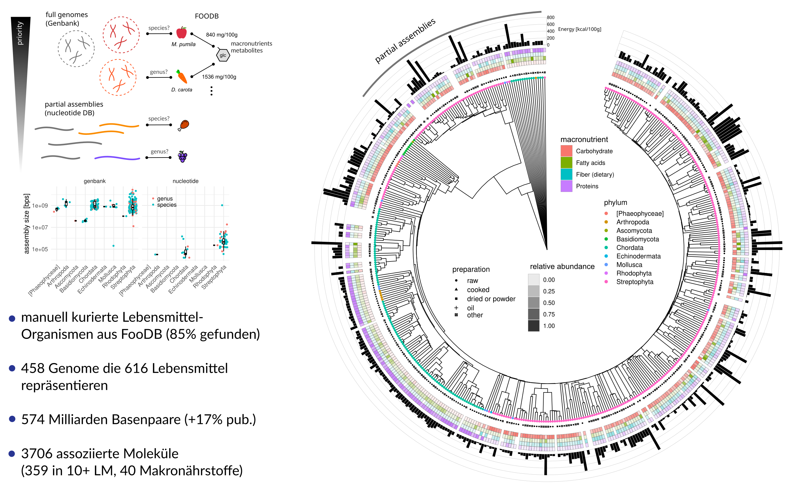

---

## Identifizierung mit sekundären Ködern

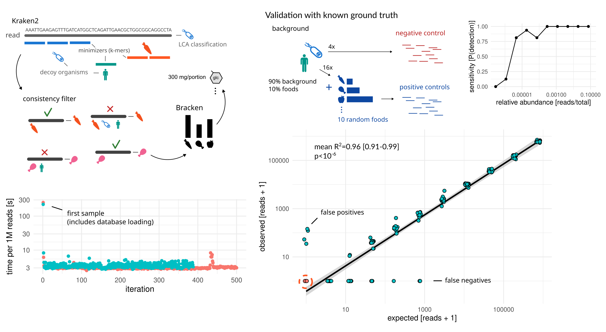

---

## Validation mit kontrollierten Ernährungsstudien

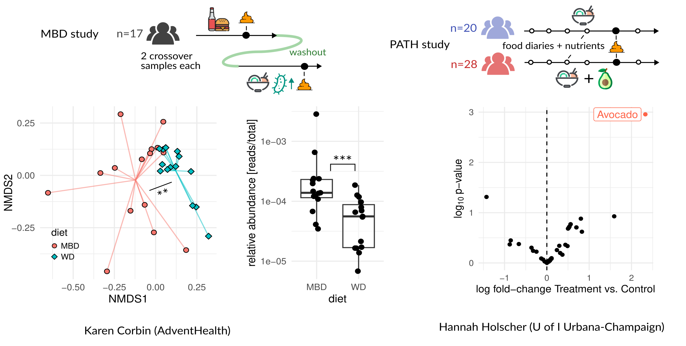

---

## Implizierte Nährstoffkomposition stimmt mit Ernährungstagebüchern überein

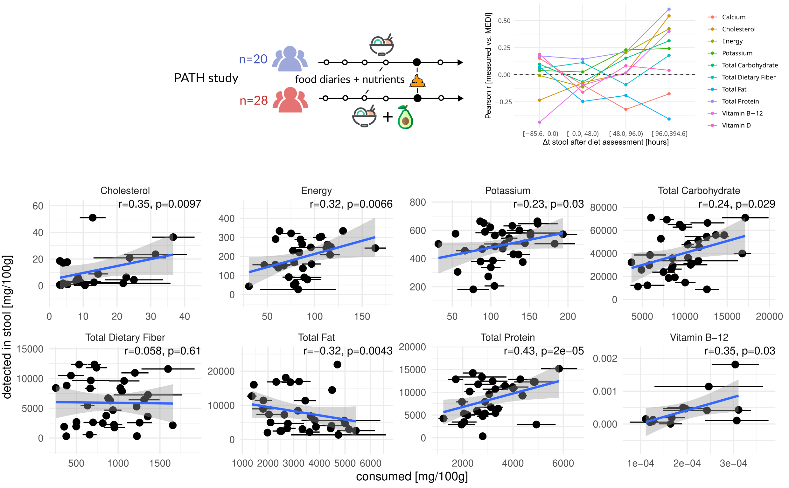

---

## Lebensmittel-DNA über die menschliche Lebensspanne

Antizipiert den Beginn von Beikost in Kleinkindern.

Gute Übereinstimmung mit Ernährungsfragebögen.

Höhere Korrelation mit Darmmikrobiom als Ernährungsfragebögen (Mantel-Test).

---

<!-- .slide: data-background="var(--primary)" class="dark" -->

*Stärken*:

- hohe Spezifizität (bis auf Speziesebene)
- quantitativ für Lebensmittel und semi-quantitativ für Nährstoffe
- schnell und retrospektiv
- standardisiert

*Limitationen*:

- kann nicht zwischen Zubereitungsart und Typ unterscheiden (Milch vs. Rindfleisch)
- relativ teuer (100-300€ pro Probe)

---

<!-- .slide: data-background="var(--primary)" class="dark" -->

## Noch nicht ganz da, aber auf dem Weg

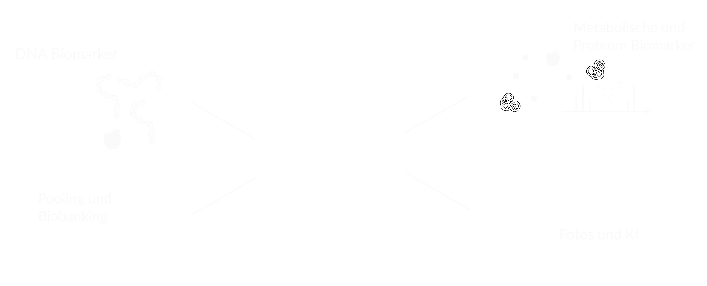

Mehr dazu: Cuparencu et al., "Integration of modern technologies to advance dietary assessment", 2026 Nature Food 
verfügbar am Montag 26.01.2016

---

<!-- .slide: data-background="assets/meduni/campus.png" class="hero no-logo" -->

# Danke! :smile:

 

**MedUni Graz** 
Klara Filek 
Christine Moissl-Eichinger

**U of I Urbana-Champaign** 
Hannah Holscher

**AdventHealth** 
Karen Corbin

**Wageningen Uni** 
Desiree Lucassen

**ISB** 
Sean Gibbons

**Uni Copenhagen** 
Catalina Cuparencu

**Fördergeber** 

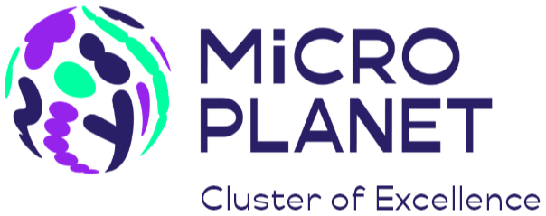 

