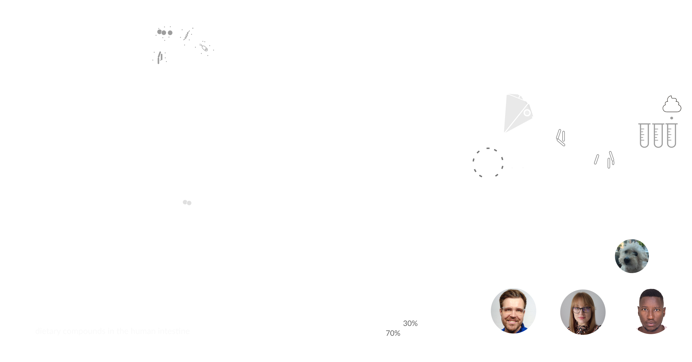
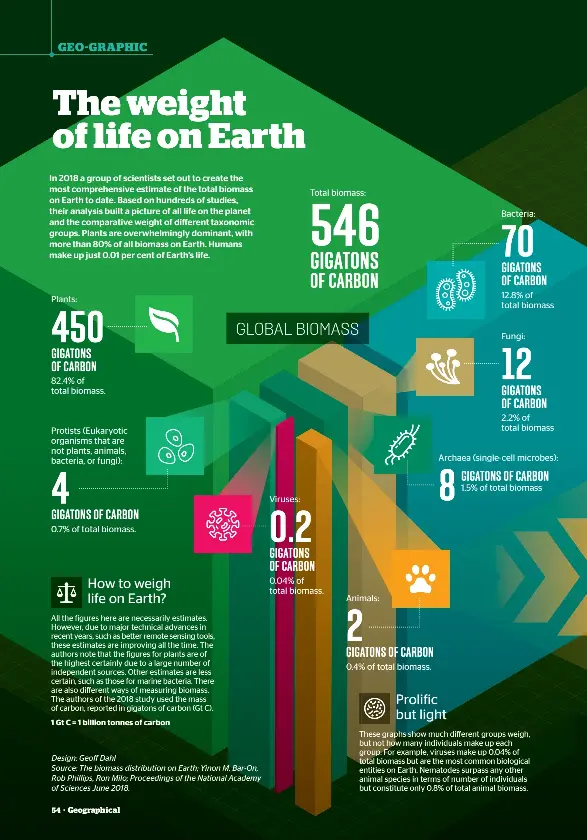
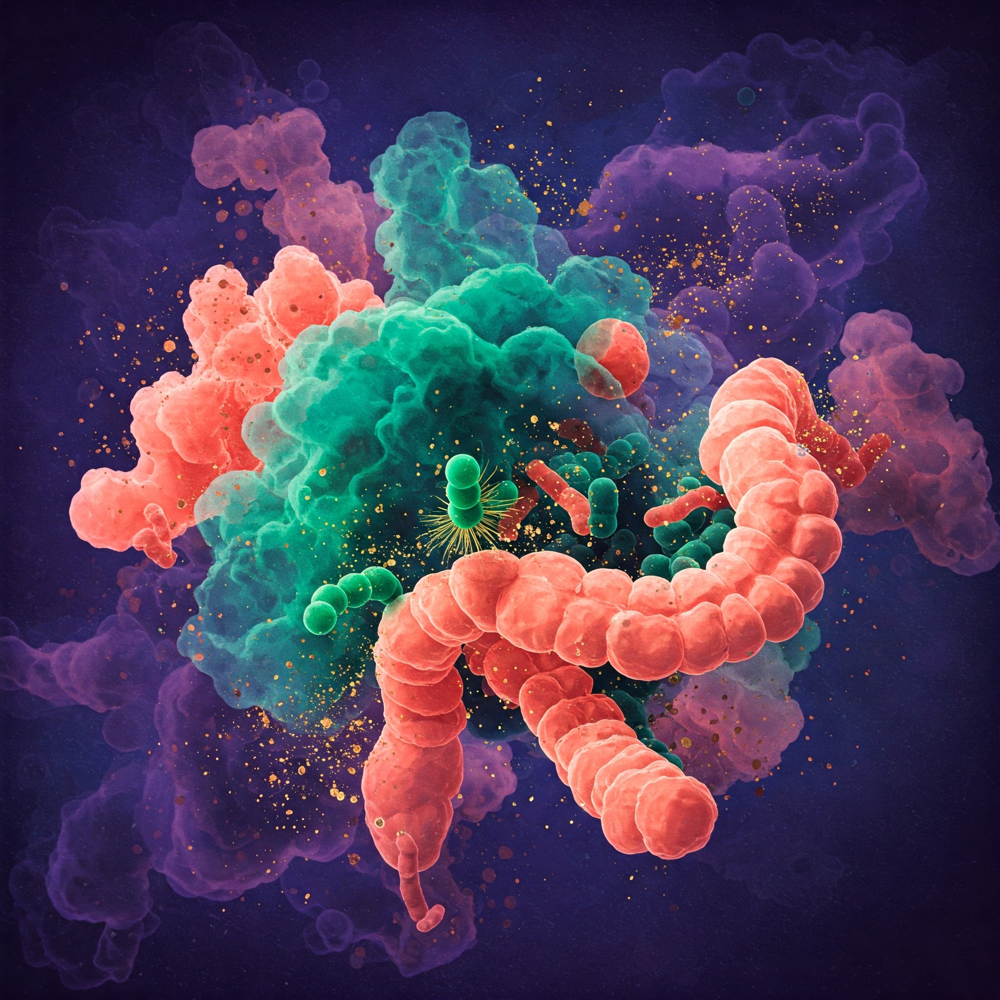
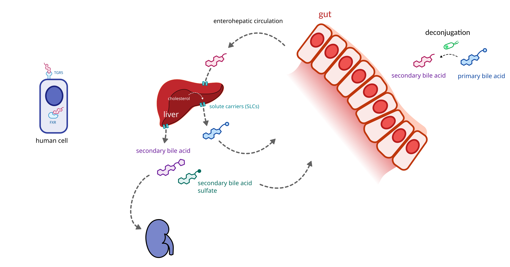
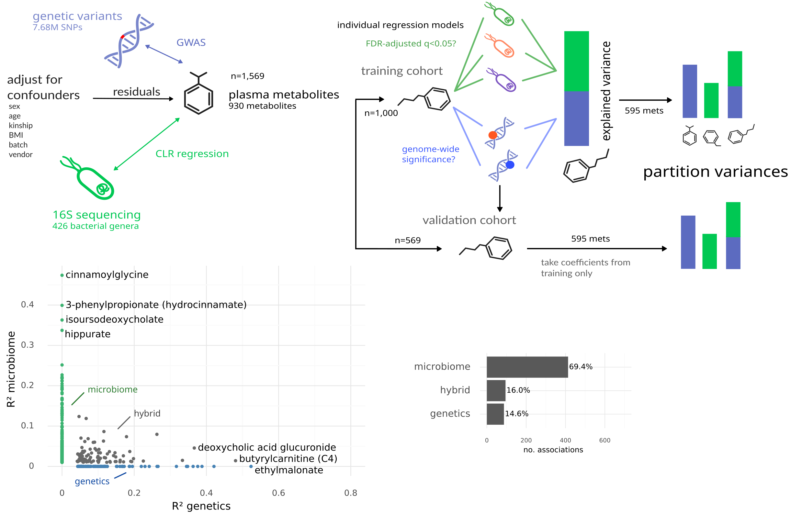
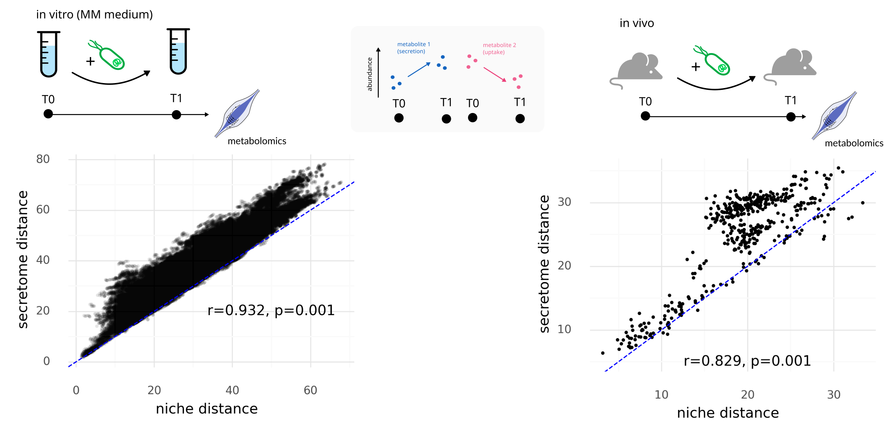
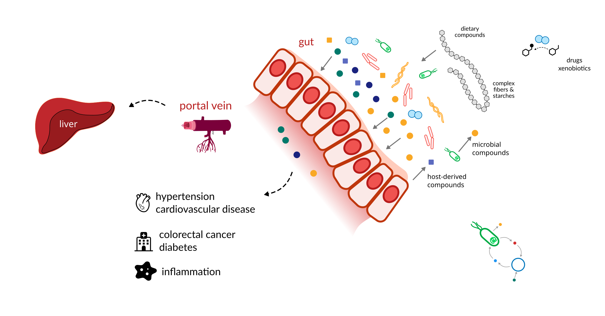
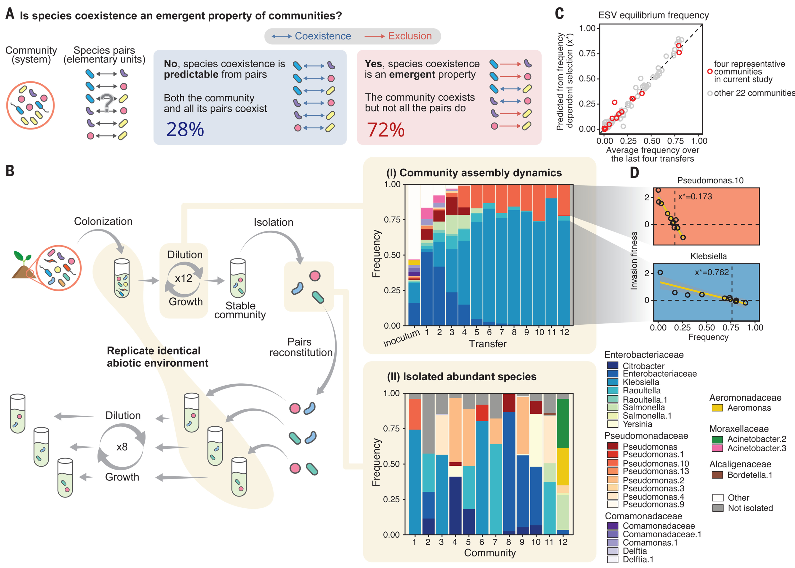
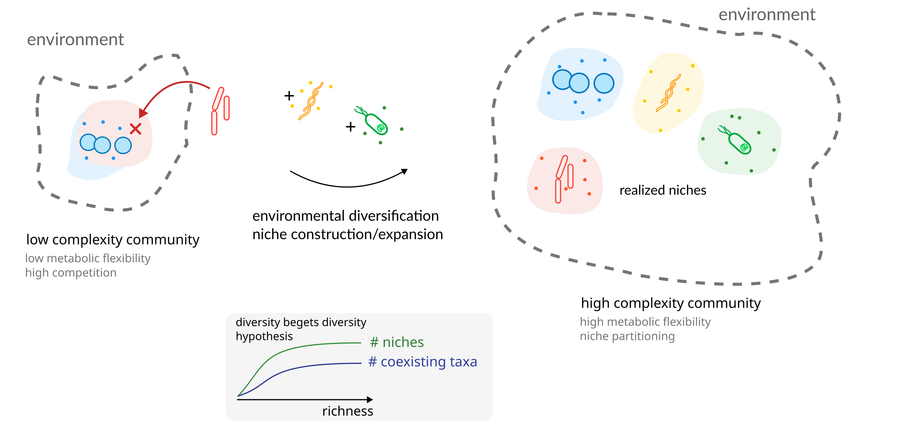
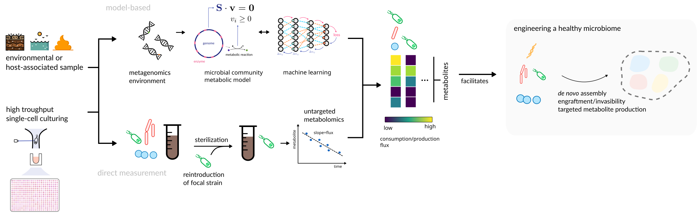

<!-- .slide: data-background="assets/backdrop.webp" class="dark no-logo" -->

# Engineering the niche space of the human gut microbiome

Christian Diener 
D&RI of Hygiene, Microbiology and Environmental Medicine

MolMed PhD program, January 2026

  

<a href=""><i class="fa-solid fa-camera-retro"></i>internal</a>
<a href="https://dienerlab.com"><i class="fa-solid fa-house-signal"></i></i>dienerlab.com</a>
<a href="https://github.com/dienerlab"><i class="fa-brands fa-github"></i>dienerlab</a>
<a href="https://bsky.app/profile/cdiener.com"><i class="fa-brands fa-bluesky"></i></i>@cdiener.com</a>

---

<!-- .slide: data-background="var(--primary)" class="dark" -->

## Who we are and what we do

---

<!-- .slide: data-background="var(--primary)" class="dark" -->

## Today I want to convince you that...

 

Microbes in the human gut are *tightly connected* to our own *metabolism*...

and

... are best studied in the *complex community context* they live in.

---

# It's a microbial world

Illustration by Geoff Dahl, Geo-graphic

- 70 gigatons of microbes on earth
- 39 trillion microbes in the human body (99% in the gut)
- microbes have massive metabolic diversity
- microbial metabolism can change our environment

---

<!-- .slide: data-background="assets/Prochlorococcus_marinus.jpg" class="light" -->

<h2 style="color: black"> Bacterial metabolism - from killer to savior </h2>

**Big Oxidation Event (~2.5B years ago)**

- dominant photosynthesis organism on our planet
- added massive amounts of O₂ to the N₂ and CO₂ atmosphere
- killed between 80-99% of the existing biosphere
- formed the basis of oxygen respiration

---

## Microbial-human co-metabolism

- breast milk contains *HMOs* that can *only* be metabolized by bacteria in the human gut (mostly Bifidobacteria)
- *>90% of serotonin* in the human body is synthesized by the gut microbiome
- many dietary compounds are *exclusively* consumed by microbes (fibers, polyphenols)
- the human gut microbiome consumes many metabolites *produced by the host* (urea, modified compounds, mucins etc.)

Let's look at some mechanisms.

Kijner et al., 2022 Current Opinion in Microbiology, https://doi.org/10.1016/j.mib.2022.102156 
Moretti et al., 2025 Cell Rep, https://doi.org/10.1016/j.celrep.2025.116434 
Sanz et al., 2025 Nat Rev Gastroenterol Hepatol, https://doi.org/10.1038/s41575-025-01077-5

---

## Bile Acids

---

## Short-chain fatty acids

---

## The majority of blood metabolites is associated with gut microbiome composition

Diener, Dai et al., 2023 Nature Metabolism, https://doi.org/10.1038/s42255-022-00670-1

---

## Metabolite secretion is determined by the metabolic niche

178 strains from Han, Van Treuren, et al., 2021 Nature, https://doi.org/10.1038/s41586-021-03707-9

---

<!-- .slide: data-background="var(--primary)" class="light" -->

Unfortunately, microbial metabolic uptake patterns (niches) in the human gut are
*very* diverse and *difficult to predict*.

---

## The human gut is a complex ecosystem

---

## Coexistence is an emergent property of complex communities

Goldford et al., 2018 Science, https://doi.org/10.1126/science.aat1168

---

## Diversity begets diversity

Complex microbial communities from the human gut *have to* be studied in the community *context*.

---

<!-- .slide: data-background="var(--primary)" class="dark no-logo" -->

## Okay, but how de we do that?

*In vivo* studies are pretty much limited to the animal model.

What's the next best thing?

---

## Approach 1: Ex vivo cultivation

---

## Approach 2: Metabolic Flux Analysis

<video width="45%" autoplay loop>
  <source src="assets/fluxes.mp4" type="video/mp4">
</video>

video courtesy of [S. Nayyak](https://twitter.com/Na_y_ak) and [J. Iwasa](https://twitter.com/janetiwasa)

---

## Microbial community metabolic models

---

### PhD project: take the next step

---

<!-- .slide: data-background="assets/meduni/flags.png" class="hero no-logo" -->

# Thanks! :smile:

<a href="https://dienerlab.com"><i class="fa-solid fa-house-signal"></i></i>&nbsp;https://dienerlab.com</a>

 

**Funding** 
&nbsp;

