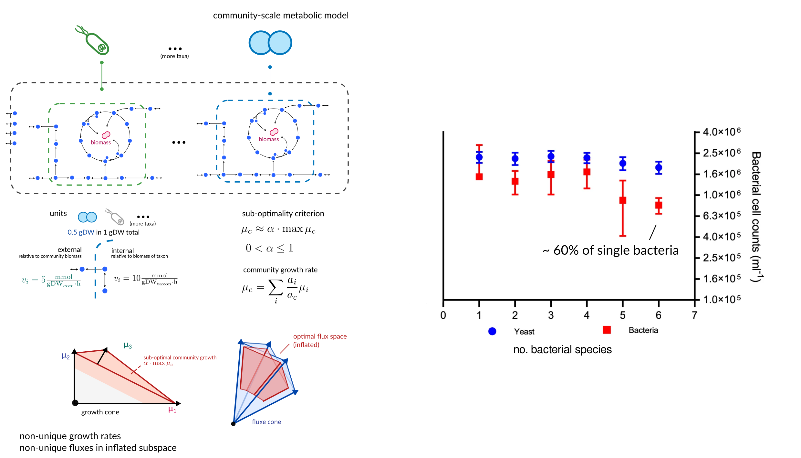
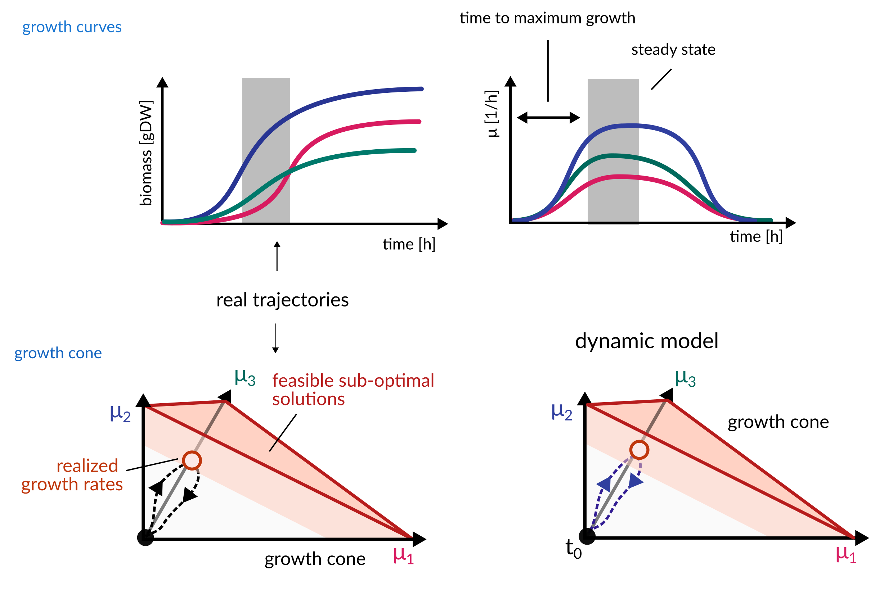
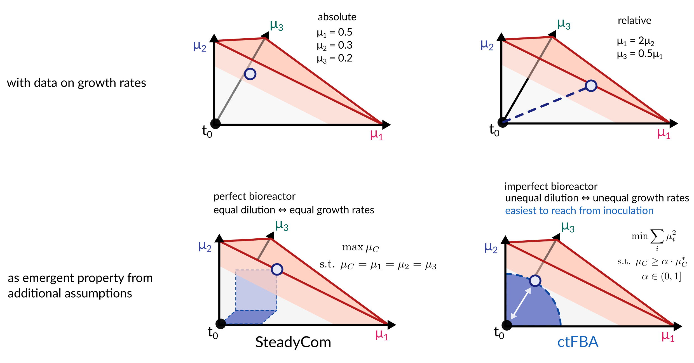
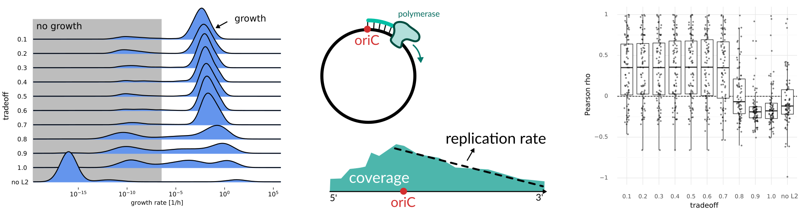
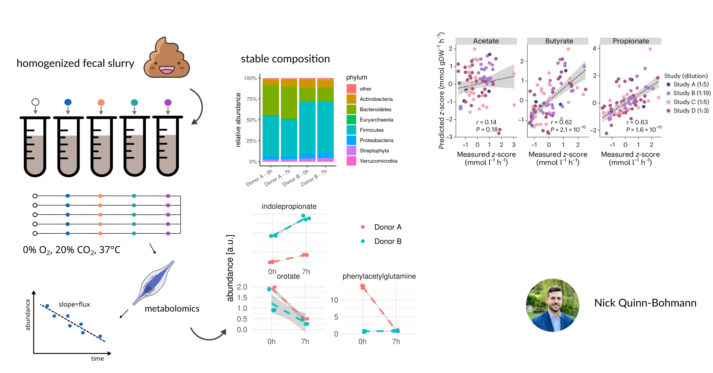
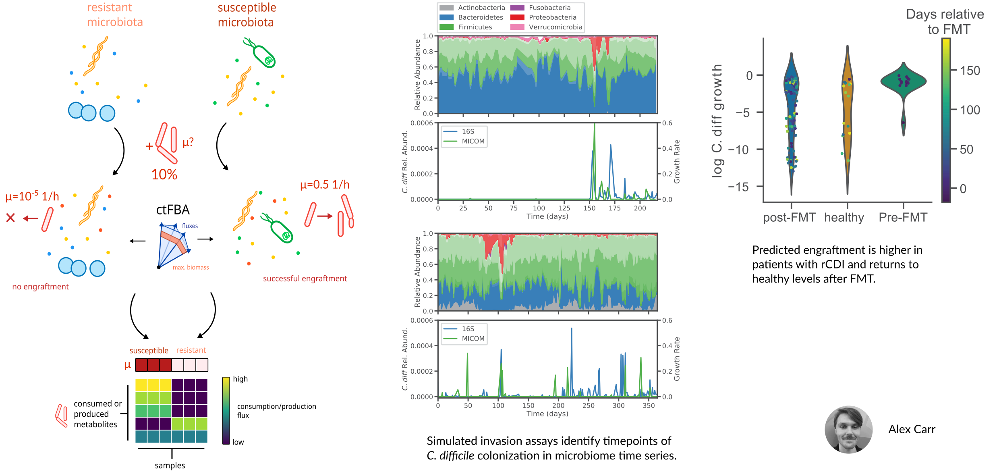
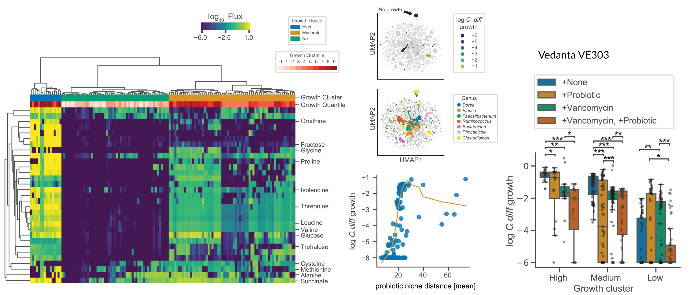

<!-- .slide: data-background="assets/backdrop.webp" class="dark no-logo" -->

## Microbial community metabolic models of the human gut microbiome

# From objectives to validation

### Christian Diener

  

<a href="https://creativecommons.org/licenses/by-sa/4.0/"><i class="fa-solid fa-camera-retro"></i>internal</a>
<a href="https://dienerlab.com"><i class="fa-solid fa-house-signal"></i></i>dienerlab.com</a>
<a href="https://github.com/dienerlab"><i class="fa-brands fa-github"></i>dienerlab</a>
<a href="https://bsky.app/profile/cdiener.com"><i class="fa-brands fa-bluesky"></i></i>@cdiener.com</a>

---

## A Complex System

- 38 trillion microbes in the human gut
- associated with a wide array of diseases
- one of the primary modulators of the immune system
- complex metabolic connections with the host

There is a *composition-function* gap.

How much of the function of *complex* microbial communities can we really glean from *abundance* data?

---

## Microbial fluxes

<video controls width="100%" autoplay>
  <source src="assets/fluxes.mp4" type="video/mp4" />
</video>

- How much fiber does the microbial community consume?
- How much butyrate is produced by <i>F. prausnitzii</i>
- How fast does a pathogen grow?

...are all questions about fluxes *not* concentrations.

---

## Flux Balance Analysis

---

## Community-models - oh boy

Diener C, Gibbons SM. More is different: Metabolic modeling of diverse microbial communities. mSystems. 2023;8: e0127022. https://doi.org/10.1128/msystems.01270-22

---

## The Growth Cone

---

## Strategies for picking solutions

---

## ctFBA improves agreement with replication rates in the gut microbiome

Diener C, et al. MICOM: Metagenome-scale modeling to infer metabolic interactions in the gut Microbiota. mSystems. 2020;5. https://doi.org/10.1128/mSystems.00606-19

---

Quinn-Bohmann N, et al. Microbial community-scale metabolic modelling predicts personalized short-chain fatty acid production profiles in the human gut. Nat Microbiol. 2024;9: 1700–1712. https://doi.org/10.1038/s41564-024-01728-4

---

## Engraftment prediction of <i>C. difficile</i>

Carr AV, et al. Personalized Clostridioides difficile colonization risk prediction and probiotic therapy assessment in the human gut. Cell Syst. 2025;16: 101367. https://doi.org/10.1016/j.cels.2025.101367

---

## <i>C. difficile</i> clusters into distinct niches that can be blocked by probiotics

---

<!-- .slide: data-background="var(--primary)" class="dark" -->

# Thanks :smile:

**MedUni Graz** 
Klara Filek 
Geoffrey Olweny 
Annelies Oismüller 
Christine Moissl-Eichinger 
Gregor Gorckiewicz

**ISB** 
Sean Gibbons 
Nick Quinn-Bohmann 
Alex Carr 

**Funding** 

