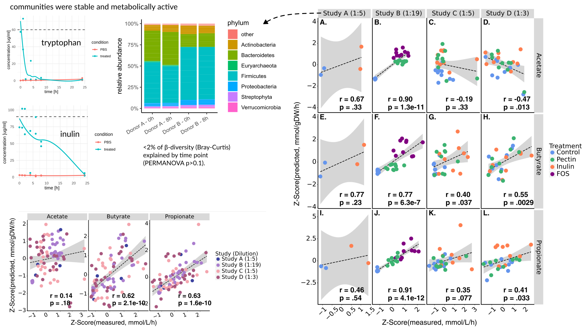

<!-- .slide: data-background="assets/backdrop.webp" class="dark no-logo" -->

# Modeling personalized interventions in the human gut microbiome

### Christian Diener

  

<a href="https://creativecommons.org/licenses/by-sa/4.0/"><i class="bx bx-cctv"></i>CC BY-SA 4.0</a>
<a href="https://dienerlab.com"><i class="bx bxs-home"></i>dienerlab.com</a>
<a href="https://github.com/dienerlab"><i class="bx bxl-github"></i>dienerlab</a>
<a href="https://twitter.com/thaasophobia"><i class="bx bxl-twitter"></i>@thaasophobia</a>
<a href="https://mstdn.science/@thaasophobia"><i class="bx bxl-mastodon"></i>@thaasophobia</a>

---

## Humans = big bags of bacteria

- you provide a home for *~38 trillion bacteria* (versus 30 trillion human cells)
- gut bacteria manufacture about 90 percent of the body's *supply of serotonin*
- *fecal microbial transplant* can ablate some gastro-intestinal diseases
- success of *PD-1 cancer therapy* can be modulated by probiotics

illustration by [Allison Kudla](http://allisonx.com/) 
Sender et al. 2016, https://doi.org/10.1371/journal.pbio.1002533 
Yano et al. 2015, https://doi.org/10.1016/j.cell.2015.02.047 
Khoruts et al. 2016, https://doi.org/10.1038/nrgastro.2016.98 
Routy et al. 2017, https://doi.org/10.1126/science.aan3706

---

<!-- .slide: data-background="var(--primary)" class="dark" -->

## Do we know enough of the rules to play the game?

  

Though we have now sequenced *millions of microbiome samples* from the human gut, mechanisms
and rational design/engineering still eludes us.

Can we explain the resulting *metabolic and biochemical processes* from *genomic* data?

*What quantities* can be readily predicted and validated to do so?

---

## Quantifying Metabolism - Fluxes

<video width="45%" autoplay loop>
  <source src="assets/fluxes.mp4" type="video/mp4">
</video>

"How fast does a species grow?" and "How much of this metabolite is produced?" are
questions about *fluxes, not concentrations*.

video courtesy of [S. Nayyak](https://twitter.com/Na_y_ak) and [J. Iwasa](https://twitter.com/janetiwasa)

---

## Flux Balance Analysis (FBA)

Diener et al. 2020, https://doi.org/10.1128/mSystems.00606-19 
Korem, Suez, Zeevi, Weinberger et al. 2015, https://dx.doi.org/10.1126%2Fscience.aac4812

---

## Screen and validate interventions in the gut microbiome

---

## Short-chain fatty acids in the human gut

---

## Rational prediction of SCFA production <i>in vitro</i>

DM38 medium (Venturelli lab), n=882 and 697, respectively

**Nick Bohmann (Gibbons Lab)**, Thomas Gurry (Myota), Ophelia Venturelli (UW-Madison)

---

## ... and <i>ex vivo</i>

---

## Strong association with host blood chemistries

Arivale cohort (n=3,129), adjusted for sex, age, and BMI

---

## There is no one-fits-all intervention for butyrate production

---

<!-- .slide: data-background="var(--primary)" class="dark" -->

## Summary

An <i>in silico</i> → <i>ex vivo</i> strategy can be used to rationally predict interventions in the human gut microbiome.

Model-predicted SCFA production is associated with host phenotypes (more than plasma measures).

Likely helpful for large-scale screening but <i>in vivo</i> validation is required.

Published at https://doi.org/10.1038/s41564-024-01728-4 .

---

<!-- .slide: data-background="assets/meduni/campus.png" class="hero no-logo" -->

# Thanks! :smile:

### ISB

**Sean Gibbons** 
Nick Bohmann 
Kat Ramos Sarmiento 
Nitin Baliga 
Noa Rappaport 
Tomasz Wilmanski

### Myota

Thomas Gurry

### UW-Madison

Ophelia Venturelli 
Erin Ostrem

### Fred Hutch

Lisa Levy 
Johanna Lampe

&nbsp;&nbsp;&nbsp;

Other research areas we work on:

- microbial niche dynamics and design
- xenobiotic-microbiome interactions (especially statins)
- microbial catabolism of host-derived compounds

---

## Construction of environmental media

